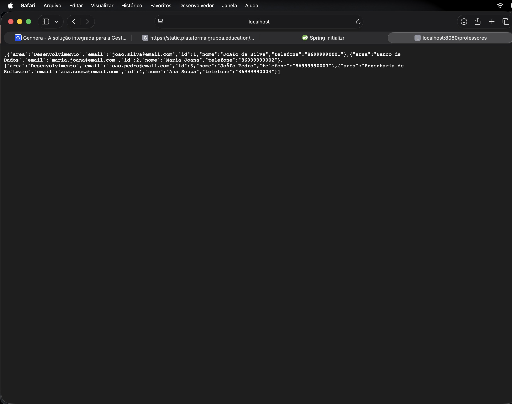
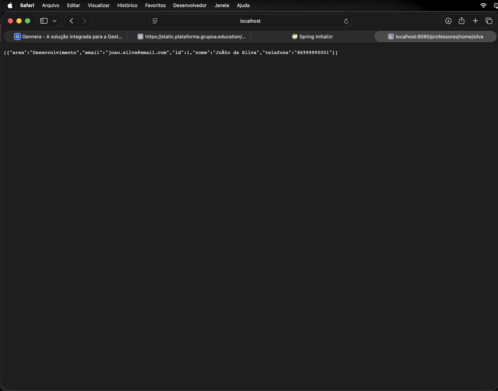
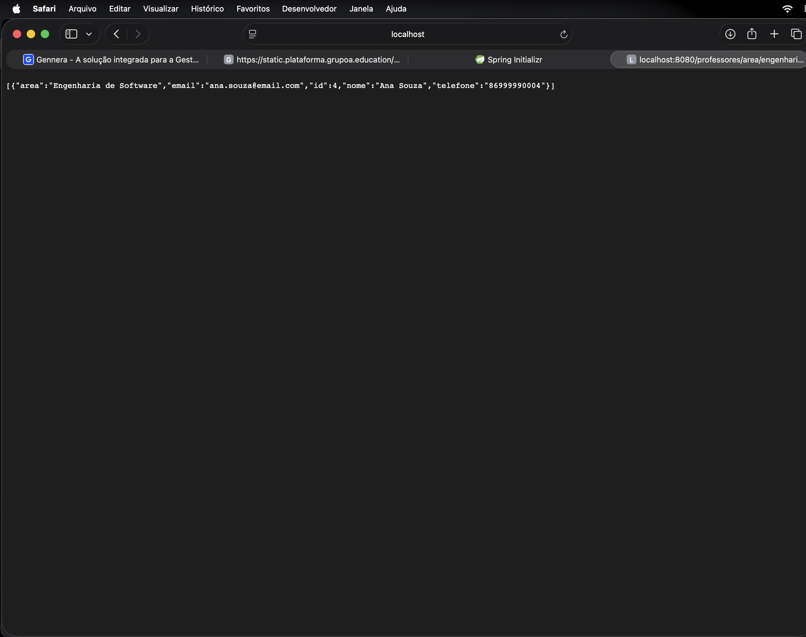
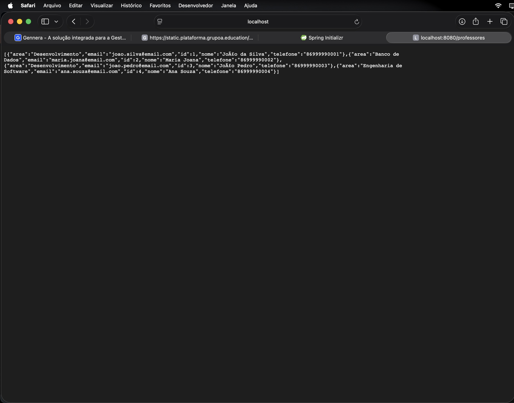
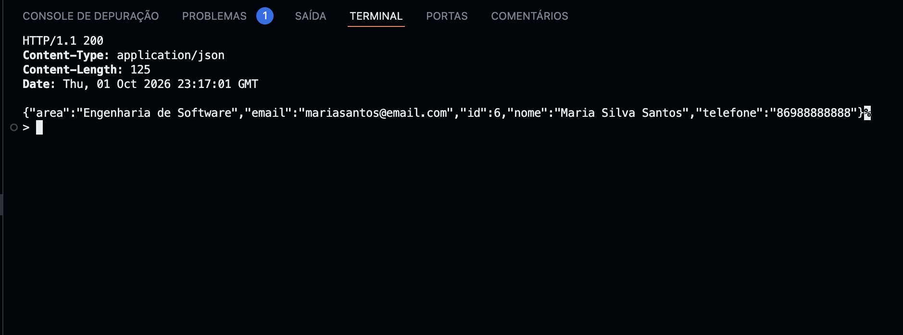
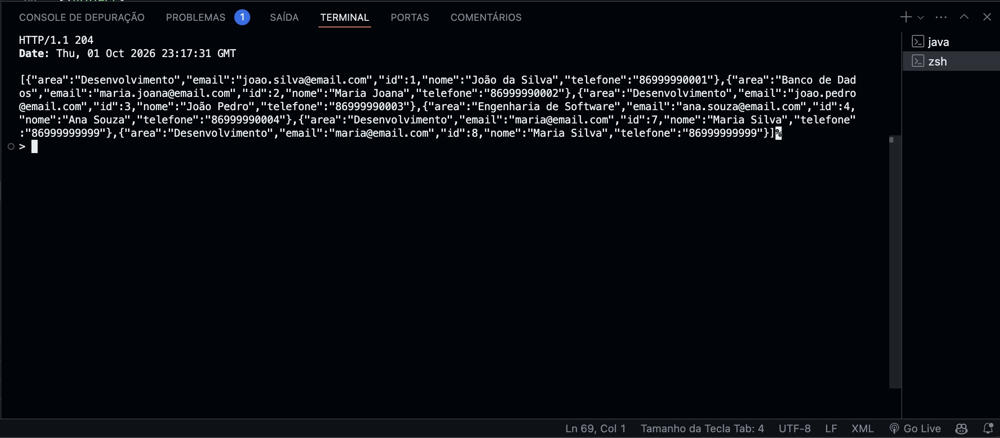

# API de Professores

**Aluno:** Joao Pedro Lima Barbosa 
**Disciplina:** Desenvolvimento Back-End com Java

## Descrição

API REST para cadastro e gerenciamento de professores, desenvolvida com Spring Boot, Spring Data JPA e PostgreSQL. Permite listar, filtrar por nome e por área, cadastrar, editar e excluir professores.

## Tecnologias utilizadas

- Java 17
- Spring Boot
- Spring Web
- Spring Data JPA
- PostgreSQL
- Maven

## Como executar

### 1. Pré-requisitos

- Java 17 ou superior
- PostgreSQL rodando na porta 5432

### 2. Banco de dados

No banco `postgres`, execute o SQL abaixo para criar a tabela e os registros iniciais:

```sql
CREATE TABLE professor (
    id BIGSERIAL PRIMARY KEY,
    nome VARCHAR(100) NOT NULL,
    email VARCHAR(100) NOT NULL,
    area VARCHAR(100) NOT NULL,
    telefone VARCHAR(20)
);

INSERT INTO professor (nome, email, area, telefone) VALUES
('João da Silva', 'joao.silva@email.com', 'Desenvolvimento', '86999990001'),
('Maria Joana', 'maria.joana@email.com', 'Banco de Dados', '86999990002'),
('João Pedro', 'joao.pedro@email.com', 'Desenvolvimento', '86999990003'),
('Ana Souza', 'ana.souza@email.com', 'Engenharia de Software', '86999990004');
```

### 3. Configuração

Em `src/main/resources/application.properties`, ajuste o usuário e a senha do seu PostgreSQL:

```properties
spring.datasource.url=jdbc:postgresql://localhost:5432/postgres
spring.datasource.username=postgres
spring.datasource.password=SUA_SENHA
```

### 4. Executar

```bash
./mvnw spring-boot:run
```

A API fica disponível em `http://localhost:8080`.

## Estrutura do projeto

```
src/main/java/br/edu/unifsa/professoresapi
 ├── controller
 ├── service
 ├── repository
 └── model
```

## Endpoints

| Método | Endpoint | Descrição | Status |
|--------|----------|-----------|--------|
| GET | `/professores` | Lista todos os professores | 200 |
| GET | `/professores/nome/{nome}` | Filtra por nome (parcial, ignora maiúsculas) | 200 |
| GET | `/professores/area/{area}` | Filtra por área (ignora maiúsculas) | 200 |
| POST | `/professores` | Cadastra um professor | 201 |
| PUT | `/professores/{id}` | Edita um professor | 200 (404 se não existir) |
| DELETE | `/professores/{id}` | Exclui um professor | 204 (404 se não existir) |

Exemplo de JSON para POST e PUT:

```json
{
  "nome": "Maria Silva",
  "email": "maria@email.com",
  "area": "Desenvolvimento",
  "telefone": "86999999999"
}
```

Observação: os filtros ignoram maiúsculas e minúsculas, mas não ignoram acentos (buscar `joão` encontra "João", buscar `joao` não).

## Evidências de execução

Os casos 1 a 4 foram testados no Postman. Os casos 5 e 6 foram testados com `curl` no terminal.

### Caso 1 - Listar professores
`GET /professores`


### Caso 2 - Filtrar por nome
`GET /professores/nome/silva`


### Caso 3 - Filtrar por área
`GET /professores/area/engenharia de software`


### Caso 4 - Cadastrar professor
`POST /professores`


### Caso 5 - Editar professor
`PUT /professores/6`

 NOT NULL,
    email VARCHAR(100) NOT NULL,
    area VARCHAR(100) NOT NULL,
    telefone VARCHAR(20)
);

INSERT INTO professor (nome, email, area, telefone) VALUES
('João da Silva', 'joao.silva@email.com', 'Desenvolvimento', '86999990001'),
('Maria Joana', 'maria.joana@email.com', 'Banco de Dados', '86999990002'),
('João Pedro', 'joao.pedro@email.com', 'Desenvolvimento', '86999990003'),
('Ana Souza', 'ana.souza@email.com', 'Engenharia de Software', '86999990004');
```

### 3. Configuração

Em `src/main/resources/application.properties`, ajuste o usuário e a senha do seu PostgreSQL:

```properties
spring.datasource.url=jdbc:postgresql://localhost:5432/postgres
spring.datasource.username=postgres
spring.datasource.password=SUA_SENHA
```

### 4. Executar

```bash
./mvnw spring-boot:run
```

A API fica disponível em `http://localhost:8080`.

## Estrutura do projeto

```
src/main/java/br/edu/unifsa/professoresapi
 ├── controller
 ├── service
 ├── repository
 └── model
```

## Endpoints

| Método | Endpoint | Descrição | Status |
|--------|----------|-----------|--------|
| GET | `/professores` | Lista todos os professores | 200 |
| GET | `/professores/nome/{nome}` | Filtra por nome (parcial, ignora maiúsculas) | 200 |
| GET | `/professores/area/{area}` | Filtra por área (ignora maiúsculas) | 200 |
| POST | `/professores` | Cadastra um professor | 201 |
| PUT | `/professores/{id}` | Edita um professor | 200 (404 se não existir) |
| DELETE | `/professores/{id}` | Exclui um professor | 204 (404 se não existir) |

Exemplo de JSON para POST e PUT:

```json
{
  "nome": "Maria Silva",
  "email": "maria@email.com",
  "area": "Desenvolvimento",
  "telefone": "86999999999"
}
```

Observação: os filtros ignoram maiúsculas e minúsculas, mas não ignoram acentos (buscar `joão` encontra "João", buscar `joao` não).

## Evidências de execução

Os casos 1 a 4 foram testados no Postman. Os casos 5 e 6 foram testados com `curl` no terminal.

### Caso 1 - Listar professores
`GET /professores`

   

### Caso 2 - Filtrar por nome
`GET /professores/nome/silva`



### Caso 3 - Filtrar por área
`GET /professores/area/engenharia de software`



### Caso 4 - Cadastrar professor
`POST /professores`



### Caso 5 - Editar professor
`PUT /professores/6`



### Caso 6 - Excluir professor
`DELETE /professores/6`


